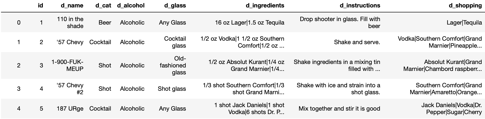

# Bartend-A.I.

  

> By: Haydin Bradshaw

## Motivation & Goal:

Applications of deep learning and neural networks have improved every industry they touch. From manufacturing, information technology, business, and engineering, the application of large data and innovative algorithms have lead to astounding improvements in these fields. Another field that could utilize the benefits of deep learning and specifically in the vein of "creativity" is the food and beverage industry.

The goal of this project is to implement the advances in recurrent neural networks (RNN) to mixology/bartending. For anyone who enjoys indulging in or creating cocktails, they realize the breadth of creativity and inspiration required of a bartender to devise new drinks. However, even the best bartender's creative well will eventually run dry. When that happens, neural networks, specifically attention augmented long short-term recurrent neural networks, can be used to help. These neural networks can be implemented to learn the "style" of a bartender's recipes and "creatively" generate new recipes to reinspire him.

## Data:

**Disclaimer: I do not own the rights to distribute the dataset. I am able to show snippets of the data used same as is provided by odditysoftware. All code utilizing this dataset is written under the assumption that someone uses the same or similar dataset as my own that is linked below.**

#### The Dataset:

For neural networks a large amount of data is a must. To fulfill my goal of building a neural network a large dataset of cocktail recipes is necessary. Credit to [*odditysoftware*](http://www.odditysoftware.com/page-datasales7.htm/) for the drinks and cocktails dataset. The dataset is comprised of 16,351 rows and 8 columns. The columns are id, d_name, d_cat (category), d_alcohol, d_glass, d_ingredients, d_instructions, d_shopping. 

Here's an example of the data:

#### EDA & Preprocessing:

The primary data needed to generate new recipes are the ingredients of the cocktails. As such, I cleaned the dataset down to only 12,294 rows which included only drinks labeled as cocktails or alcoholic ordinary drink. From there I removed the 7 null rows and added a new column, "ingredients", to host all of the d_ingredients data as a comma-separated string.

From further investigation, the average number of ingredients used is 4, with a maximum of 16 and minimum of 1. Along with that the most used ingredient is unsurprisingly Vodka. I would say this is a perfect range of lengths for RNNs, but considering the sheer volume of text, it will till suffer from short-term memory problems and vanishing gradients which will be addressed later. 

  

Now comes to preprocessing. In regards to text generation projects, a significant problem that can occur is one where the text lacks regularization. In regards to the data at hand, it contains 13 different units of measurement: oz, gallon, shot, liter, quart, pint, cup, jigger, tbsp, tsp, dash, ml and cl. When the neural network is learning from an unregularized set of data, it can lose the context of words and we could end up with relations such as these:

  

  

In order to have the network learn properly, all units of measurement are converted into milliliters and any fractions or digits into floats. All of the data is then cast to string and outputted to a text file with each line of the file being a single recipe.

### Recurrent Neural Networks with LSTM and Attention layers:

  

Now for the fun part! I'll reiterate the goal of this project. To build a neural network to generate new cocktail recipes that are either good as is or that can be used to inspire bartenders/mixologists in a creative slump. When thinking about this objective and the problem to solve, text generation, the method to solve it is through recurrent neural networks. Now standard RNNs without any additional advanced layers suffer greatly from short term memory problems. RNNs sequentially run their data through the network to get a prediction. Then it uses a loss function to compare the prediction to a ground truth thereby getting an error value. 

  

This error value is then used in back propogatin to calcuate gradients which modify the internal weights of the network's nodes allowing for what is considered learning. Herein lies the problem, as the gradient goes back through the network it's own value changes based on its effects to the nodes before it. So if it had a small effect on an earlier layer of nodes, it will have an even smaller effect on the next set.

  

Hopefully these illustration (courtesy of Michael Nguyen) will help in understandng the concept. To summarize in simpler terms, think of the problem as what was first seen or learned by the network is most easily forgotten. 

In order to correct this vanishing gradient problem and further improve the neural network's memory and learning ability, bidirectional long short-term memory (LSTM) and attention layers are added. LSTM layers are important as they add an input, forget, and output gate. These will take the input, and apply a sigmoid activation function upon it allowing the LSTM cell to decide what is allowed. Bidirectionality is also included in order for the neural network to take into account the characters before and after those of interest in order to increase the network's context-awareness. Lastly, attention is included in order to allow the network to look back at the input as well as the word currently being generated and produce weights that help better determine its final outcome. Along with that, it helps the network to understand word order and context by its ability to reference input material.

For further reading I'd recommend the following articles: [attention](https://medium.com/syncedreview/a-brief-overview-of-attention-mechanism-13c578ba9129), [lstm](http://colah.github.io/posts/2015-08-Understanding-LSTMs/), [bidirectional](https://machinelearningmastery.com/develop-bidirectional-lstm-sequence-classification-python-keras/), and a little of it [all](https://towardsdatascience.com/the-arti-canon-neural-text-generation-2a8f032c2a68)

Now, putting that all together a neural network such as this arises:

  

## Outcomes:

#### Modeling:

The data was preprocessed as outlined above, it was then tokenized to get a vocabulary mapping of unique characters. Next I defined batch size, embedding size, RNN cells, and batch size. Lastly, I built a model using deep bidirectional LSTM cells with sigmoid activation, a dense layer with softmax activation, an optimizer set to adam, and finally a loss function of categorical cross entropy. Let's dive a bit deeper into some of these choices:

* Categorical Cross Entropy: Generally used with a softmax activation layer and is used for multi-class classification problems. As we are getting a probability between 0 and 1 from our softmax dense layer, this will be used to quantify the loss between the predicted character and that it was expecting from the training data.
* Softmax: It squeezes a vector between 0 and 1 and all elements coming from this sum to 1. When this is used on output scores, these elements values from the squeezed vectors then represent the probability of the elements classification being correct. 
* sigmoid: Necessary in LSTMs for proper output values of 0 to 1 in order to gauge the amount of to be allowed through the forget and output gates.

Upon running this initial recurrent neural network the result was this:

> Baseline result

  

As can be seen it was complete gibberish. After multiple attempts to rectify the problems, a module was found called textgenrnn courtesy of Max Woolf. Using standard parameters I was able to get a new baseline with results such as this:

Loss change from 1.0642 - 0.5725 = 0.4917

  

As can be seen from this example, the recipes' ingredients begin to repeat. The network does not properly understand the underlying structure, order, and relationship between ingredients yet. The vocab, config, and weight files are available in the data folder for recreation. 

Having created a new baseline I went and began optimizing the various hyperparameters associated with the textgenrnn module as well as editting its standard activation and loss functions. Experimenting with various activation and loss functions made no significant improvements to the quality of recipes generated by pre-chosen options. I did however, come to find an optimal set of hyperparameters for my purposes as can also be found in the Data folder. 

These parameters resulted in a loss value change from 0.9162 - 0.3702 = 0.546 and some of the final recipe results will be shown below.

I had mentioned previously in this project concerning the desire to "creatively" generate cocktail recipes. One may be wondering how that is accomplished and the answer to that is temperature. In simplest terms it is a control of the confidence and conservativeness of the softmax function in choosing an output classification. The lower the number, the more certain it is and more conservative its choices for output and vice versa. To be more technical, it is the value that is used to divide the logits (probability values) of the LSTM cell by before applying softmax. The smaller the temperature value, the larger the result from applying softmax and therefore the more probable its class being the correct choice for output. 

#### Metrics:

As this is an unsupervised learning project, metrics for it are inherently difficult to judge as there are no labels or classes to be compared to/tested against. As such it must be judged by people. As a mixologist myself, this will be accomplished by personally trying various recipes that seem creative or elliciting inspiration and then sharing these with others. In so doing I will be able to get input and ratings from others to validate the efficacy of these generated recipes. I will also be uploading them to allrecipes.com and recipefy.com

## Final Results:

Here you will find a few of the recipes that I have created as is or modified and made for myself and others. Surprisingly, all of them were successes in terms of flavors to those who have tried them. Testing will be ongoing as I generate more recipes that inspire new ideas. Those that are noteworth will be uploaded to the aforementioned websites under the name Rob Tender in order to share with others and garner feedback by way of ratings and comments. I also would like to ask the reader to either try the cocktails listed below for themselves or run the cocktail generator themselves to try new and creative concotions. 

Thanks you for time and drink responsibly!

  

  

  

## Future Direction:

In the future I would like to take this project in a few new directions.

1. Add more recipes from various other bars and bartenders so as to allow the model to imitate their style of cocktail
2. Build a webapp utilizing the weights, vocab, and conifgurations of this dataset and the additional styles of various bars and bartenders to allow others more/targeted inspiration for unique concoctions.

## References & Contributions:

1. [textgenrnn](https://github.com/minimaxir/textgenrnn)

2. [Overview of attention mechanism](https://medium.com/syncedreview/a-brief-overview-of-attention-mechanism-13c578ba9129) 

3. [Undertanding LSTMs](http://colah.github.io/posts/2015-08-Understanding-LSTMs/)

4. [Develop Bidirectional LSTM sequence classificaion](https://machinelearningmastery.com/develop-bidirectional-lstm-sequence-classification-python-keras/)

5. [The arti cannon neural text generation](https://towardsdatascience.com/the-arti-canon-neural-text-generation-2a8f032c2a68)

6. [Tensorflow](https://www.tensorflow.org/tutorials)

7. [Keras](https://keras.io/examples/lstm_text_generation/)

8. [Allrecipes](https://www.allrecipes.com)

9. [Recipefy](https://www.recipefy.com)

10. Adobe spark in fascilitating the creation of cocktail cards

11. Google images for title images and neural network gifs.
